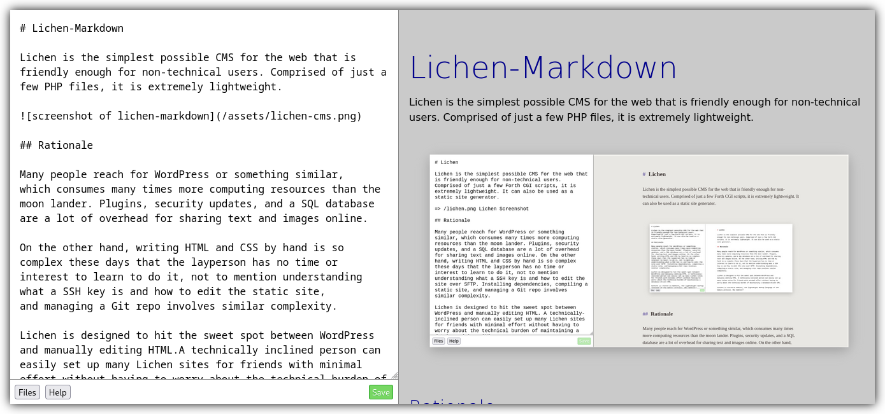

<!--
Ohart ongi: README hau automatikoki sortu da <https://github.com/YunoHost/apps/tree/master/tools/readme_generator>ri esker
EZ editatu eskuz.
-->

# Lichen-Markdown YunoHost-erako

[](https://ci-apps.yunohost.org/ci/apps/lichenmarkdown/)


[](https://install-app.yunohost.org/?app=lichenmarkdown)

*[Irakurri README hau beste hizkuntzatan.](./ALL_README.md)*

> *Pakete honek Lichen-Markdown YunoHost zerbitzari batean azkar eta zailtasunik gabe instalatzea ahalbidetzen dizu.*  
> *YunoHost ez baduzu, kontsultatu [gida](https://yunohost.org/install) nola instalatu ikasteko.*

## Aurreikuspena

Lichen-Markdown is a simple and lightweight CMS inspired by [permacomputing](https://permacomputing.net). It is "the simplest possible CMS for the web that is friendly enough for non-technical users."


**Paketatutako bertsioa:** 1.0.0~ynh1

## Pantaila-argazkiak



## Dokumentazioa eta baliabideak

- Administratzaileen dokumentazio ofiziala: <https://lichen.commoninternet.net>
- Jatorrizko aplikazioaren kode-gordailua: <https://codeberg.org/ukrudt.net/lichen-markdown/>
- YunoHost Denda: <https://apps.yunohost.org/app/lichenmarkdown>
- Eman errore baten berri: <https://github.com/YunoHost-Apps/lichenmarkdown_ynh/issues>

## Garatzaileentzako informazioa

Bidali `pull request`a [`testing` abarrera](https://github.com/YunoHost-Apps/lichenmarkdown_ynh/tree/testing).

`testing` abarra probatzeko, ondorengoa egin:

```bash
sudo yunohost app install https://github.com/YunoHost-Apps/lichenmarkdown_ynh/tree/testing --debug
edo
sudo yunohost app upgrade lichenmarkdown -u https://github.com/YunoHost-Apps/lichenmarkdown_ynh/tree/testing --debug
```

**Informazio gehiago aplikazioaren paketatzeari buruz:** <https://yunohost.org/packaging_apps>
