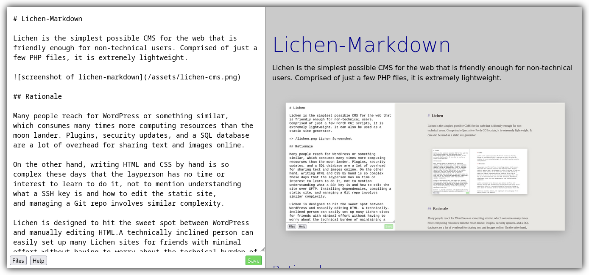

<!--
Важно: этот README был автоматически сгенерирован <https://github.com/YunoHost/apps/tree/master/tools/readme_generator>
Он НЕ ДОЛЖЕН редактироваться вручную.
-->

# Lichen-Markdown для YunoHost

[](https://ci-apps.yunohost.org/ci/apps/lichenmarkdown/)


[](https://install-app.yunohost.org/?app=lichenmarkdown)

*[Прочтите этот README на других языках.](./ALL_README.md)*

> *Этот пакет позволяет Вам установить Lichen-Markdown быстро и просто на YunoHost-сервер.*  
> *Если у Вас нет YunoHost, пожалуйста, посмотрите [инструкцию](https://yunohost.org/install), чтобы узнать, как установить его.*

## Обзор

Lichen-Markdown is a simple and lightweight CMS inspired by [permacomputing](https://permacomputing.net). It is "the simplest possible CMS for the web that is friendly enough for non-technical users."


**Поставляемая версия:** 1.2.1~ynh2

## Снимки экрана



## Документация и ресурсы

- Официальная документация администратора: <https://lichen.commoninternet.net>
- Репозиторий кода главной ветки приложения: <https://codeberg.org/ukrudt.net/lichen-markdown/>
- Магазин YunoHost: <https://apps.yunohost.org/app/lichenmarkdown>
- Сообщите об ошибке: <https://github.com/YunoHost-Apps/lichenmarkdown_ynh/issues>

## Информация для разработчиков

Пришлите Ваш запрос на слияние в [ветку `testing`](https://github.com/YunoHost-Apps/lichenmarkdown_ynh/tree/testing).

Чтобы попробовать ветку `testing`, пожалуйста, сделайте что-то вроде этого:

```bash
sudo yunohost app install https://github.com/YunoHost-Apps/lichenmarkdown_ynh/tree/testing --debug
или
sudo yunohost app upgrade lichenmarkdown -u https://github.com/YunoHost-Apps/lichenmarkdown_ynh/tree/testing --debug
```

**Больше информации о пакетировании приложений:** <https://yunohost.org/packaging_apps>
